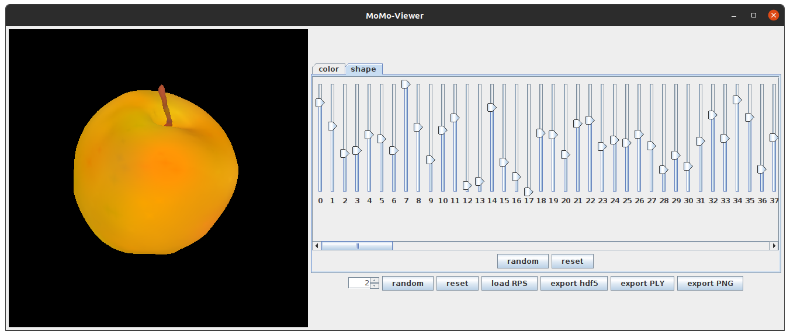

# Building 3D Morphable Models from a Single Scan

This repository contains the code required to replicate almost all of the experiments presented in the paper ["Building 3D Morphable Models from a Single Scan"](https://arxiv.org/abs/2011.12440).  It does not include the datasets used with this paper, nor does it include all the code involved in producing this paper's figures.  It also does not include the code to replicate our fish reconstruction experiment, due to legal restrictions.

## Exploring the GUI
We provide a GUI tool that enables to build a 3D morphable model (3DMM) from a single scan of your choice.
This GUI is based on this [repository](https://github.com/unibas-gravis/basel-face-model-viewer).



### Requirements
- [Java](http://www.oracle.com/technetwork/java/javase/downloads/index.html) 8.0 (Oracle or OpenJDK) with JavaFX must be installed.

### Run (precompiled):
- Download `release.jar` under [release](https://github.com/skylar-sutherland/single-scan-3dmms/releases).
- Run `java -Xmx5g -jar release.jar`  You might need more than 5 GB depending on the number of vertices of your mesh.
- You need to provide a mesh as an ASCII-encoded .ply file with albedo represented through vertex coloring rather than a texture map.  You can, for instance, use the average face from the Basel Face Model, or the bird mesh provided with this repository (located at `pipeline-data/references/bird_reference_gradient.ply`).
- The viewer expects your mesh to be centered and around 20cm wide (in units of mm).  You can translate and resize your mesh using [MeshLab](https://www.meshlab.net/).
- The GUI will build the model.  This may take a while, depending on the number of vertices of your mesh.

### Usage:
- Upper random and reset button will update the active tab's color/shape parameters.
- Lower random and reset button will update all model parameters.
- The button `load RPS` will load rendering parameters from an .rps file (currently only shape, color and expression)
- The button `export hdf5` will save the current model in the Scalismo .h5 file format.
- The button `export PLY` will save the current instance as a mesh in the .ply file format (thanks to ImageSynthTue).
- The button `export PNG` enables writing the current instance as an image in the .png file format.
- Sliders are ordered according to the order of principal components.
- The maximal parameter value corresponding to the sliders can be adjusted.
- Press `Ctrl` to change the pose with the mouse (first click on the mesh to activate the frame).

## Installation for Developers

### Step 1: Installing Java

You will need a working installation of Java 8 with JavaFX to run the code.  On Ubuntu 18, the following commands should install the proper version of Java:

```
sudo apt install libopenjfx-java=8u161-b12-1ubuntu2
sudo apt install libopenjfx-jni=8u161-b12-1ubuntu2
sudo apt install openjfx=8u161-b12-1ubuntu2
sudo apt-mark hold openjfx libopenjfx-jni libopenjfx-java
```

### Step 2: Installing SBT

You will also require the Scala Build Tool.  Instructions on how to install it are given [here](http://www.scala-sbt.org/release/tutorial/Setup.html).

### Step 3: Unpacking pipeline-data and scan

The next step is to unpack `pipeline-data.zip` and `scan.zip`.  These contain the directory structure our software needs, as well as some of the data used in our experiments.

### Step 4: Building the project

To compile the project, run `sbt assembly` in the terminal while in the top level of the directory.

## External files

Many of our experiments require additional data.  We do not include this data for licensing reasons.  **Note that if you do not wish to run a given set of experiments, you do not need the dataset for those experiments.**

### The 2019 Basel Face Model

Most of our experiments, and in particular nearly all our experiments with faces, require the mean faces of the 2019 Basel Face Model.  To download these, first obtain the 2019 Basel Face Model from the [University of Basel](https://faces.dmi.unibas.ch/bfm/bfm2019.html).  Then, using the login information provided in the email that the University of Basel sends to you, download the following files: 
[https://faces.dmi.unibas.ch/bfm/bfm2019/restricted/model2019_bfm_nomouth_noexpression_mean.ply](https://faces.dmi.unibas.ch/bfm/bfm2019/restricted/model2019_bfm_nomouth_noexpression_mean.ply)
[https://faces.dmi.unibas.ch/bfm/bfm2019/restricted/model2019_bfm_nomouth_noexpression_lvl1_mean.ply](https://faces.dmi.unibas.ch/bfm/bfm2019/restricted/model2019_bfm_nomouth_noexpression_lvl1_mean.ply)
Then copy these files (`model2019_bfm_nomouth_noexpression_mean.ply` and `model2019_bfm_nomouth_noexpression_lvl1_mean.ply`) into `pipeline-data/data/references`.

### Face scans provided with the 2009 Basel Face Model

Our experiments with actual face scans (as opposed to the mean of the 2019 Basel Face Model) require the 10 scans provided with the 2009 Basel Face Model.  These can be downloaded from the [University of Basel](https://faces.dmi.unibas.ch/bfm/index.php?nav=1-2&id=downloads).  Once downloaded, copy the contents of `PublicMM1/03_scans_ply` into `pipeline-data/data/bfm_scans`.

### The 2017 Basel Face Model

For the models built using the 10 face scans provided with the 2009 Basel Face Model, we use landmark information provided in the 2017 Basel Face Model.  This can be downloaded from the [University of Basel](https://faces.dmi.unibas.ch/bfm/bfm2017.html).  Copy the file `model2017-1_face12_nomouth.h5` into `pipeline-data/data/`.

### The Labeled Faces in the Wild dataset

Our qualitative face reconstruction experiments use images from the Labeled Faces in the Wild dataset.  This dataset can be downloaded from the [University of Massachusetts Amherst](http://vis-www.cs.umass.edu/lfw/lfw.tgz).  Once downloaded, select the files from this dataset that correspond to the landmark (TLMS) files in `pipeline-data/qualitative_lfw/lfw_selection/`, convert them to PNGs, and move them into the same folder as the landmark files.

### The Caltech-UCSD Birds 200 dataset

Our bird reconstruction experiments use images from the Caltech-UCSD Birds 200 dataset.  This can be downloaded from [Caltech](http://www.vision.caltech.edu/visipedia/CUB-200-2011.html).  Once downloaded, select the files from this dataset that correspond to the landmark (TLMS) files in `pipeline-data/qualitative_lfw/bird_lfw_selection/`, convert them to PNGs, and move them into the same folder as the landmark files.

### The Multi-PIE dataset

For our face recognition experiments, we used images from the [CMU Multi-PIE](https://www.cs.cmu.edu/afs/cs/project/PIE/MultiPie/Multi-Pie/Home.html) dataset, with the landmarks provided with the 2017 Basel Face Model.

To get this data, download the additional data provided with the 2017 Basel Face Model from the [University of Basel](https://faces.dmi.unibas.ch/bfm/bfm2017.html).  Then copy the contents of the folder `pipeline-data/recognition-experiment/landmarks` within the downloaded archive into the directory `pipeline-data/recogition/landmarks`.  Then follow the direction provided with the `README` file in the `pipeline-data/recognition-experiment` within the downloaded archive to fill the `pipeline-data/recognition/originals` folder.

### *Optional:* Simple Morphable Model Viewer

Many of our experiments involve the production of 3DMMs.  These 3DMMs are saved as HDF5 (.h5) files.  Samples from these 3DMMs are also saved; however, if you wish to visualize the 3DMM directly, you can do so using the [Simple Morphable Model Viewer](https://github.com/unibas-gravis/basel-face-model-viewer).  Our 3DMMs are fully compatible with this tool.  Furthermore, if Java has been successfully set up to run our experiments, it should also be able to run the Simple Morphable Model Viewer.  However, this tool only provides a method of visualizing 3DMMs; it is not required to run any of our experiments.

## Running experiments

To run experiments, run `sbt run` in the top level directory to get a list of possible experiments, and then enter the number of the relevant experiment.  Note that `sbt run` may append irrelevant characters to the end of some class names.

**Some experiments require that other experiments have been run, or that some additional piece of data is present.**  See the "Dependencies for each experiment" section for a list of experiment depencies.

### Rendering Gaussian processes

- *onemesh.Render{RGB, XYZ}Model{Standard, Correlated, Symmetric}Smooth*: These experiments generate and render samples from the various albedo models applied to the mean of the 2019 Basel Face Model.  Note that there is no *onemesh.RenderRGBModelSymmetric* experiment.  Specifically:
    * *onemesh.RenderRGBModelStandardSmooth*: Render samples from *K<sub>a, rgb</sub>* applied to the mean of the 2019 Basel Face Model.  The samples are saved in `scan/bfm19_gp_renders/smoothstandard_rgbimgs`.
    * *onemesh.RenderRGBModelCorrelatedSmooth*: Render samples from *K<sub>a, rgb</sub><sup>sym</sup>* applied to the mean of the 2019 Basel Face Model.  The samples are saved in `scan/bfm19_gp_renders/smoothcorrelated_rgbimgs`.
    * *onemesh.RenderXYZModelStandardSmooth*: Render samples from *K<sub>a, xyz</sub>* applied to the mean of the 2019 Basel Face Model.  The samples are saved in `scan/bfm19_gp_renders/smoothstandard_xyzimgs`.
    * *onemesh.RenderXYZModelCorrelatedSmooth*: Render samples from *K<sub>a, xyz</sub><sup>cor</sup>* applied to the mean of the 2019 Basel Face Model.  The samples are saved in `scan/bfm19_gp_renders/smoothcorrelated_xyzimgs`.
    * *onemesh.RenderXYZModelSymmetricSmooth*: Render samples from *K<sub>a, xyz</sub><sup>sym</sup>* applied to the mean of the 2019 Basel Face Model.  The samples are saved in `scan/bfm19_gp_renders/smoothsymmetric_xyzimgs`.
- *onemesh.SampleFromBirdModels*: Render samples from the bird 3DMMs in frontal and side views.  The samples are saved in `scan/bird_samples/front` and `scan/bird_samples/side`.
- *onemesh.RenderShapeDeformation*: Render samples from *K<sub>s</sub>* applied to the mean of the 2019 Basel Face Model.  The samples are saved in `scan/bfm19_gp_renders/shapeimgs`.
- *onemesh.RenderSymmetricShapeDeformation*: Render samples from *K<sub>s</sub><sup>sym</sup>* applied to the mean of the 2019 Basel Face Model.  The samples are saved in `scan/bfm19_gp_renders/symmetric_shapeimgs`.

### Building single-scan 3DMMs

- *onemesh.Render{RGB, XYZ, MultiSpace}Model{Standard, Correlated, Symmetric}*: These experiments generate and render samples from full 3DMMs built using the mean of the 2019 Basel Face Model, and save the 3DMMs as HDF5 files.  Specifically:
    * *onemesh.RenderRGBModelStandard*: Render samples from standard-RGB, and save the 3DMM as an HDF5 file.  The samples are saved in `scan/bfm19/standard_rgbimgs`, and the 3DMM is saved at `scan/bfm19/standard_rgbmodel.h5`.
    * *onemesh.RenderRGBModelCorrelated*: Render samples from correlated-RGB, and save the 3DMM as an HDF5 file.  The samples are saved in `scan/bfm19/correlated_rgbimgs`, and the 3DMM is saved at `scan/bfm19/correlated_rgbmodel.h5`.
    * *onemesh.RenderRGBModelSymmetric*: Render samples from symmetric-RGB, and save the 3DMM as an HDF5 file.  The samples are saved in `scan/bfm19/symmetric_rgbimgs`, and the 3DMM is saved at `scan/bfm19/symmetric_rgbmodel.h5`.
    * *onemesh.RenderXYZModelStandard*: Render samples from standard-XYZ, and save the 3DMM as an HDF5 file.  The samples are saved in `scan/bfm19/standard_xyzimgs`, and the 3DMM is saved at `scan/bfm19/standard_xyzmodel.h5`.
    * *onemesh.RenderXYZModelCorrelated*: Render samples from correlated-XYZ, and save the 3DMM as an HDF5 file.  The samples are saved in `scan/bfm19/correlated_xyzimgs`, and the 3DMM is saved at `scan/bfm19/correlated_xyzmodel.h5`.
    * *onemesh.RenderXYZModelSymmetric*: Render samples from symmetric-XYZ, and save the 3DMM as an HDF5 file.  The samples are saved in `scan/bfm19/symmetric_xyzimgs`, and the 3DMM is saved at `scan/bfm19/symmetric_xyzmodel.h5`.
    * *onemesh.RenderMultiSpaceModelStandard*: Render samples from standard-full, and save the 3DMM as an HDF5 file.  The samples are saved in `scan/bfm19/standard_multiimgs`, and the 3DMM is saved at `scan/bfm19/standard_combinedmodel.h5`.
    * *onemesh.RenderMultiSpaceModelCorrelated*: Render samples from correlated-full, and save the 3DMM as an HDF5 file.  The samples are saved in `scan/bfm19/correlated_multiimgs`, and the 3DMM is saved at `scan/bfm19/correlated_combinedmodel.h5`.
    * *onemesh.RenderMultiSpaceModelSymmetric*: Render samples from symmetric-full, and save the 3DMM as an HDF5 file.  The samples are saved in `scan/bfm19/symmetric_multiimgs`, and the 3DMM is saved at `scan/bfm19/symmetric_combinedmodel.h5`.
- *onemesh.Render{XYZ, MultiSpace}ModelBird{Standard, Symmetric}*: These experiments generate and render samples from full 3DMMs built using the bird mesh, and save the 3DMMs as HDF5 files.  Specifically:
    * *onemesh.RenderXYZModelBirdStandard*: Render samples from the 3DMM built from the bird mesh with *K<sub>s</sub>* and *K<sub>a, xyz</sub>*, and save the 3DMM as an HDF5 file.  The samples are saved in `scan/birds/bird_standard_xyzimgs`, and the 3DMM is saved at `scan/birds/bird_standard_xyzmodel.h5`.
    * *onemesh.RenderXYZModelBirdSymmetric*: Render samples from the 3DMM built from the bird mesh with *K<sub>s</sub><sup>sym</sup>* and *K<sub>a, xyz</sub><sup>sym</sup>*, and save the 3DMM as an HDF5 file.  The samples are saved in `scan/birds/bird_symmetric_xyzimgs`, and the 3DMM is saved at `scan/birds/bird_symmetric_xyzmodel.h5`.
    * *onemesh.RenderMultiSpaceModelBirdStandard*: Render samples from the 3DMM built from the bird mesh with *K<sub>s</sub>* and *K<sub>a</sub>*, and save the 3DMM as an HDF5 file.  The samples are saved in `scan/birds/bird_standard_multiimgs`, and the 3DMM is saved at `scan/birds/bird_standard_combinedmodel.h5`.
    * *onemesh.RenderMultiSpaceModelBirdSymmetric*: Render samples from the 3DMM built from the bird mesh with *K<sub>s</sub><sup>sym</sup>* and *K<sub>a</sub><sup>sym</sup>*, and save the result as an HDF5 file.  The samples are saved in `scan/birds/bird_symmetric_multiimgs`, and the 3DMM is saved at `scan/birds/bird_symmetric_combinedmodel.h5`.
- *onemesh.RenderMultiSpaceSymmetricWithDifferentMeans*: Generate and render samples from the symmetric-001, symmetric-002, symmetric-006, symmetric-014, symmetric-017, symmetric-022, symmetric-022, symmetric-052, symmetric-053, symmetric-293, and symmetric-323 3DMMs, and save these 3DMMs as HDF5 files.  The samples and 3DMMs are saved in `scan/bfmscan_symmetric_multimodels`. 
- *onemesh.RenderMultiSpaceModelLvl3Standard*: Generate and render samples from a variant of the standard-full model using a mean mesh with the full polygon count, as opposed to the reduced polygon count mesh used in other experiments, and save the 3DMM as an HDF5 file.  The samples are saved in `scan/bfm19_lvl3/lvl3_standard_multiimgs`, and the 3DMM is saved at `scan/bfm19_lvl3/lvl3_standard_combinedmodel.h5`.

### Registration experiments

- *fitting.experiments.Crop*: Crop the meshes provided with the 2009 Basel Face Model so as to only include the face region.
- *fitting.experiments.Align*: Align the meshes produced by *fitting.experiments.Crop* so as to have a common orientation.
- *fitting.experiments.Registration*: Register the meshes produced by *fitting.experiments.Align* to the topology of the full polygon count version of the 2019 Basel Face Model, using both shape and albedo information in registration.
- *fitting.experiments.RegistrationNoAlbedoConsistency*: Register the meshes produced by *fitting.experiments.Align* to the topology of the full polygon count version of the 2019 Basel Face Model, using only shape information in registration.
- *fitting.experiments.EvaluateShapeRegistration*: Quantitatively evaluate the shape registration results produced by *fitting.experiments.Registration* and *fitting.experiments.RegistrationNoAlbedoConsistency*. 
- *fitting.experiments.BuildRegistrationModels*: Build 3DMMs from the registered meshes using principal component analysis, and render the means and the first principal components of the shape and albedo models. 

### Face recognition experiments

- *fitting.experiments.FaceRecognitionFromBFMMean*: Perform face recognition using the nine 3DMMs built from the mean of the 2019 Basel Face Model: standard-RGB, standard-XYZ, standard-full, correlated-RGB, correlated-XYZ, correlated-full, symmetric-RGB, symmetric-XYZ, and symmetric-full.
- *fitting.experiments.FaceRecognitionFromSingleFaceScans*: Perform face recognition using the ten 3DMMs built from individual face scans.
- *fitting.experiments.FaceRecognitionFrom10ScanPCA*: Perform face recognition with a 3DMM build from the ten face scans using principal component analysis.
- *fitting.experiments.FaceRecognitionFrom10ScanKDE*: Perform face recognition with the ten 3DMMs built from individual face scans using our kernel density estimation approach.

### Qualitative reconstruction experiments

- *fitting.experiments.BFMMeanFaceLFW*: Qualitatively reconstruct faces using the nine 3DMMs built from the mean of the 2019 Basel Face Model: standard-RGB, standard-XYZ, standard-full, correlated-RGB, correlated-XYZ, correlated-full, symmetric-RGB, symmetric-XYZ, and symmetric-full.
- *fitting.experiments.ScanFaceLFW*: Qualitatively reconstruct faces using the ten 3DMMs built from individual face scans.
- *fitting.experiments.BirdLFW*: Qualitatively reconstruct birds using the four bird 3DMMs.

### Other experiments

- *gui.BuildAndView*: Run the UI.

### Dependencies for each experiment

- *onemesh.Render{RGB, XYZ}Model{Standard, Correlated, Symmetric}Smooth*: These experiments depend on the level 1 version of the mean of the 2019 Basel Face Model, i.e. `model2019_bfm_nomouth_noexpression_lvl1_mean.ply`.
- *onemesh.SampleFromBirdModels*: This experiment requires that all of the *onemesh.Render{XYZ, MultiSpace}ModelBird{Standard, Symmetric}* experiments have been run.
- *onemesh.RenderShapeDeformation*: This experiment depends on the level 1 version of the mean of the 2019 Basel Face Model, i.e. `model2019_bfm_nomouth_noexpression_lvl1_mean.ply`.
- *onemesh.RenderSymmetricShapeDeformation*: This experiment depends on the level 1 version of the mean of the 2019 Basel Face Model, i.e. `model2019_bfm_nomouth_noexpression_lvl1_mean.ply`.
- *onemesh.Render{RGB, XYZ, MultiSpace}Model{Standard, Correlated, Symmetric}*:  These experiments depend on the level 1 version of the mean of the 2019 Basel Face Model, i.e. `model2019_bfm_nomouth_noexpression_lvl1_mean.ply`.
- *onemesh.Render{XYZ, MultiSpace}ModelBird{Standard, Symmetric}*: These experiments have no dependencies.
- *onemesh.RenderMultiSpaceSymmetricWithDifferentMeans*: This experiment requires that *fitting.experiments.Align* has been run.
- *onemesh.RenderMultiSpaceModelLvl3Standard*: This experiment depends on the full polygon count version of the mean of the 2019 Basel Face Model, i.e. `model2019_bfm_nomouth_noexpression_mean.ply`.
- *fitting.experiments.Crop*: This experiment requires that the meshes provided with the 2009 Basel Face Model are present.
- *fitting.experiments.Align*: This experiment requires that *fitting.experiments.Crop* has been run and that the 2017 Basel Face Model HDF5 file (`model2017-1_face12_nomouth.h5`) is present.
- *fitting.experiments.Registration*: This experiment requires that *fitting.experiments.Align* and *onemesh.RenderMultiSpaceModelLvl3Standard* have been run.
- *fitting.experiments.RegistrationNoAlbedoConsistency*: This experiment requires that *fitting.experiments.Align* and *onemesh.RenderMultiSpaceModelLvl3Standard* have been run.
- *fitting.experiments.EvaluateShapeRegistration*: This experiment requires that *fitting.experiments.Registration* and *fitting.experiments.RegistrationNoAlbedoConsistency* have been run.
- *fitting.experiments.BuildRegistrationModels*: This experiment requires that *fitting.experiments.Registration* and *fitting.experiments.RegistrationNoAlbedoConsistency* have been run.
- *fitting.experiments.FaceRecognitionFromBFMMean*: This experiment requires that all of the *onemesh.Render{RGB, XYZ, MultiSpace}Model{Standard, Correlated, Symmetric}* experiments have been run and that the Multi-PIE images are present.
- *fitting.experiments.FaceRecognitionFromSingleFaceScans*: This experiment requires that *onemesh.RenderMultiSpaceSymmetricWithDifferentMeans* has been run and that the Multi-PIE images are present.
- *fitting.experiments.FaceRecognitionFrom10ScanPCA*: This experiment requires that *fitting.experiments.BuildRegistrationModels* has been run and that the Multi-PIE images are present.
- *fitting.experiments.FaceRecognitionFrom10ScanKDE*: This experiment requires that *fitting.experiments.FaceRecognitionFromSingleFaceScans* has been run and that the Multi-PIE images are present.
- *fitting.experiments.BFMMeanFaceLFW*: This experiment requires that all of the *onemesh.Render{RGB, XYZ, MultiSpace}Model{Standard, Correlated, Symmetric}* experiments have been run and that the Labeled Faces in the Wild images are present.
- *fitting.experiments.ScanFaceLFW*: This experiment requires that *onemesh.RenderMultiSpaceSymmetricWithDifferentMeans* has been run and that the Labeled Faces in the Wild images are present.
- *fitting.experiments.BirdLFW*: This experiment requires that all of the *onemesh.Render{XYZ, MultiSpace}ModelBird{Standard, Symmetric}* experiments have been run and that the Caltech-UCSD Birds 200 images are present.
- *gui.BuildAndView*: This experiment has no dependencies.

## Modifying the Code

As this project is open-source, you are, of course, welcome to modify the code.  The files of primary interest in this regard are those in the `onemesh` package.  This package is divided into three files as follows:

- `CombinedModel.scala` includes the code for defining the Gaussian process models of shape and albedo used in our paper.
- `CombinedModelHelpers.scala` includes helper functions for building and saving 3D morphable models from Gaussian processes and generating and rendering samples from them.
- `CreateCombinedModel.scala` includes the runnable scripts for generating and saving the specific 3D morphable models used in our paper, along with samples. 

The most likely modification you may wish to make is to experiment with using different Gaussian processes when building our 3D morphable models.  If you wish just wish to try changing the scalar-valued Gaussian processes, or the hyperparameters used in our symmetry and color-channel correlation heuristics, simply change *CombinedModel.Hyperparameters*.

If you wish to define new Gaussian processes along with our existing ones, copy *CombinedModel.Hyperparameters* and change the copy.  Then, depending on which you wish to change, copy one or more of *CombinedModel.RGBStandardGaussianProcess*, *CombinedModel.XYZStandardGaussianProcess*, *CombinedModel.RGBCorrelatedGaussianProcess*, *CombinedModel.XYZCorrelatedGaussianProcess*, *CombinedModel.shapeGaussianProcess*, *CombinedModel.XYZSymmetricGaussianProcess*, *CombinedModel.symmetricShapeGaussianProcess*, and change the copy to use your new version of the *CombinedModel.Hyperparameters*.  Then, copy one of the relevant scripts in `CreateCombinedModel.scala` and change it to use your new Gaussian processes.

For those who wish to look more deeply into the code, a list of all the functionality present in `CombinedModel.scala` is offered at the top of that file; that is the best place to begin understanding how our code works.

## Citation

If you use a model or the code in your research, please cite the following paper (as well as external data sources):

Skylar Sutherland, Bernhard Egger and Joshua Tenenbaum. "Building 3D Morphable Models from a Single Scan". arXiv preprint.  arXiv:2011.1244, 2020.
[https://arxiv.org/abs/2011.12440](https://arxiv.org/abs/2011.12440)

BibTeX:

    @article{sutherland2020building,
      title={Building 3D Morphable Models from a Single Scan},
      author={Sutherland, Skylar and Egger, Bernhard and Tenenbaum, Joshua},
      journal={arXiv preprint arXiv:2011.12440},
      year={2020}
    }
